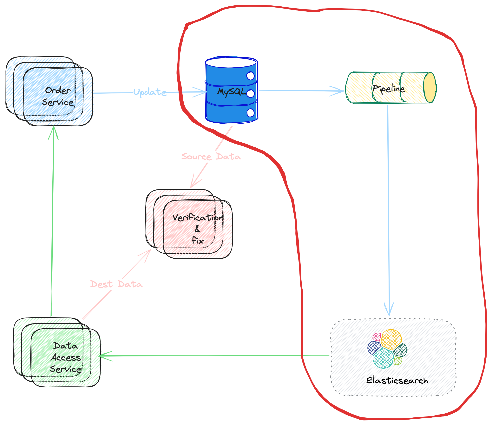
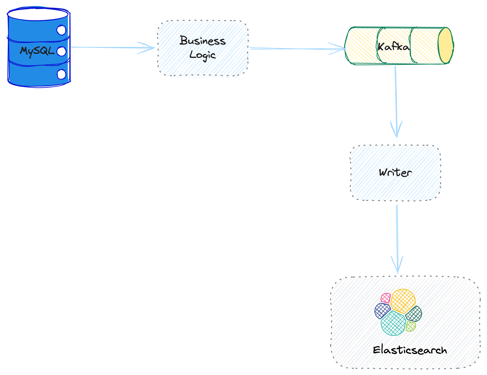

# Pipelines 

In this poster, let's talk about the `pipeline` part in the solution (shown as **Picture 1**). The term `pipeline` have same meaning (and usage scenario) as the `pipeline` with the context of **Linux Shell**. Actually, the ideas are same, consider data like water flow the pipelines. 

Back to the data service. There are many possible solutions for the data pipeline. But usually, there are some same patterns behind them,

* The data are proceed asynchronously. 
* The data is usually generated/converted from the **data modification event** from the main data store. 
* There is usually some business logic to handle the data before writing it to the secondary storage.

<b>Picture 1. Pipeline Flow</b>

### Solution One: Business Logic + Queue  

In this solution, `Message Queue` component is used to connect the data flows, for example, `Kafka` is a good choice for many scenarios.

* The `Business Logic` works as the producer to the Kafka. It mainly works on:
    * Catch the main data storage update event, and process the data with dedicated business logic.
    * Produce the messages to kafka, with pre-defined protocol. 
    
* The `Writer` works at the consumer to the kafka. 
    * It consumes data from Kafka, and
    * Write the data to ElasticSearch.

<b>Picture 2. Business Loigc & Queue Solution</b>

##### Business Logic

There are several key problems to consider about the business logic. 

1. How to catch the main data store update event? 

   Usually, the Business Logic does not NOT catch the update event directly. Instead, there may be anther abstracted layer, which would listen the main data store update, and populate the event somewhere, for example, Kafka. So that, the Business Logic can just work as a Kafka consumer. Benefits are:
    * Decouple the main data store part and the Business Logic
    * Reduce the complexity of Business Logic
    
   We would talk about this layer later (marked as TBA for now)
2. How to make sure there is no data lost during consuming data from the data update event queue? 
3. How to make sure there is no data lost when producing messages to downstream kafka
4. How to define the `data protocol` between the producer (the Business Logic) and consumer (the Writer)

