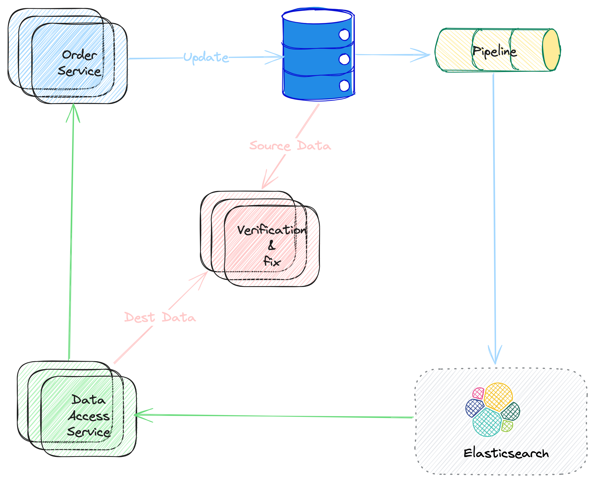

# A Secondary Heterogeneous Data Service

### Concept

In this section, I will introduce a `Secondary Heterogeneous Data Service` with the E-commerce scenario. The key meaning of key words as follows:

* **Secondary** means the data stored by the service is not the MAIN data. For example, the data of the main business service may be stored by MySQL database, but for some dedicated purpose, we may need to store the **secondary** copy of data somewhere.
* **Heterogeneous** means the structure of the data (depending on the purpose of the service) is DIFFERENT from the main data. For example, the main data is stored by MySQL, but the 2nd copy is stored by ElasticSearch or other engines.

### Key Problems

We can get the key points at the first glance to this concept,

* The **data sync mechanism** between the main and the secondary copy.
* The **data consistency** between the two copies. And,
* How to **store** and **query** the second copy.

In this series of posters, let's talk about each of them, and the solutions of course. 

### A Real World Example

First, let's look at an example from the real world.

##### Background

In the real world, MySQL is widely used as data store for e-commerce scenarios. And as the data scale growing, there would be new problems on our way. For example, 

* As data scale growing, a common solution is to **shard the data** (we would talk about the data sharding in other series). For example, the `order` data maybe sharded by `order_id`. This works fine when query with `order_id`, for example, query the details of one order. But what if, we need to list all the order for one specific user?  
* Usually, to improve the performance of data query, we need to setup some secondary indexes, but not too many. That's because too many indexes would impact the write performance. So, we need to think about carefully on which columns to involve the secondary indexes. Beside that, it impacts the online performance heavily also when adding/updating/deleting secondary indexes. But what if we really need this when there is a new business scenario?
* Sometimes we may need some data aggregations based on the main data. One way is to do the aggregation on querying, and another way is just to record the aggregated somewhere. When query latency is required to be low, we may need to use the latter one solution. And the aggregation rules maybe changed from time to time (This is actually OLAP scenario). Definitely, we should NOT use this main storage for this.

##### Solution

The illustration of a possible solution as follows. 
* The `Order Service` is the user side to this data service
* The blue narrows stands for the **data sync**, which is asynchronous in the solution.
* The green narrows stands for the **data query** flow.  
* The pink narrows illustrate the **data consistency verification & fixing** flow.

In the following articles, let's talk about the details of each part.

<b>Picture 1. Solution Architecture</b>

