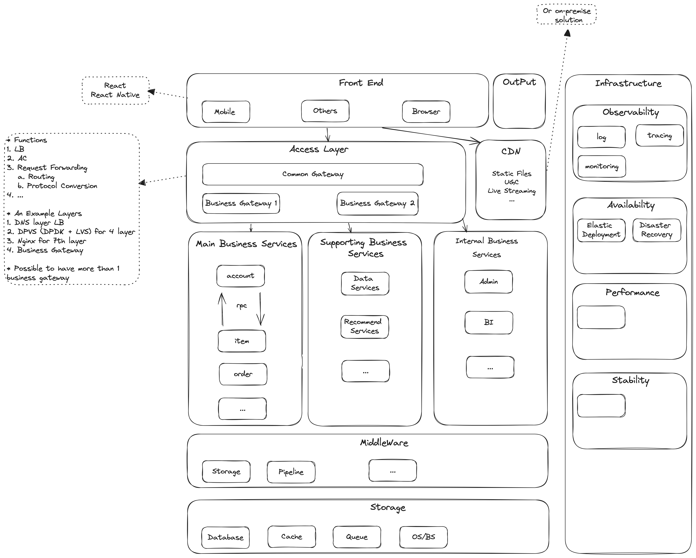

# Web System Tech Stacks


With this note, I would record the tech stack of web system, typically, say that, an `E-commerce System`. The following topics would be included but not limited to:
* `High Level Architecture` of each layer sub system.
* `Key Problems` and `Best Practices` each layer of the sub systems.
* `Principle` and `Implementation` of components with the system


### Architecture of an E-commerce System



### Knowledge MindMaps

The following topics would be noted.

```uml

@startmindmap

+ E-commerce System 

left side

**[#lightblue] Front End

**[#lightgreen] Access Layer
***[#lightgreen] Load Balancing
***[#lightgreen] Access Control
***[#lightgreen] Request Fowarding
****[#lightgreen] Routing
****[#lightgreen] Protocol Conversion
***[#lightgreen] Other Supporting functions

**[#yellow] Business Services
***[#yellow] Domain Knowledges

**[#gold] Data Services
***[#gold] Domain Knowledges

**[#pink] Middlewares
***[#pink] RPC
***[#pink] Data Access

**[#lightgrey] Data Storage
***[#lightgrey] Database
***[#lightgrey] Queue
***[#lightgrey] Cache


right side

**[#aliceblue] Obvervability
***[#aliceblue] Log
***[#aliceblue] Tracing
***[#aliceblue] Metrics

**[#azure] Availability
***[#azure] Elastic Deployment
***[#azure] Service Discovery

@endmindmap
```
